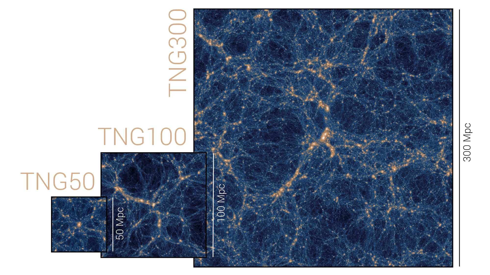
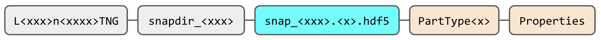
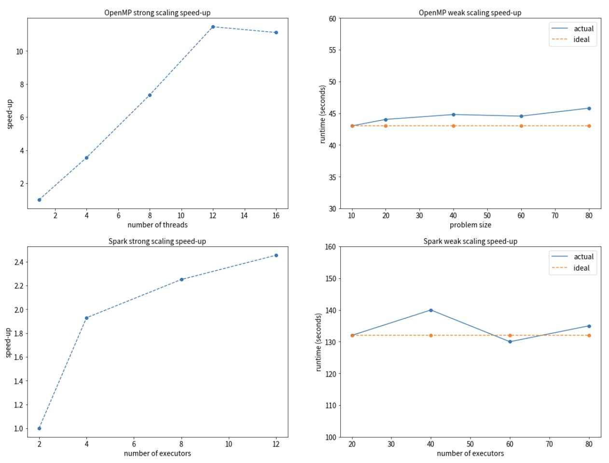
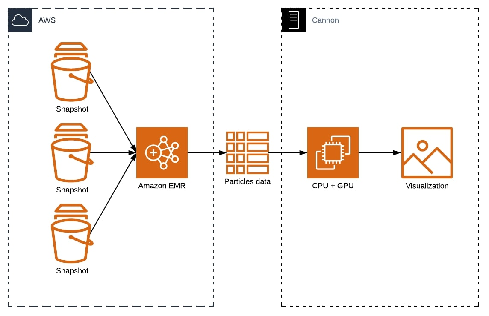

## TRACKING GALAXIES OVER TIME

### Motivation

Ever since the Big Bang until present-day, galaxies have been continuously evolving - into the state we all see now and ever-changing. Astronomers have made understanding galaxy formation and evolution possible by building large simulations of sections of the universe: we can “carve out” a part of the universe and record various aspects of particles of interest within for a period of time. By mapping the properties of these particles to 3-dimensional space, we can visualize the behavior of our galaxies of interest. Some of these complicated features include magnetic fields, gas cooling, black holes, and supernovas. These simulations serve as an important building block to unveil the mysteries of the universe.

At the center of every galaxy is a supermassive black hole which grows through swallowing nearby gas and by merging with other black holes. This black hole can inject energy and momentum back into the gas around it, and is therefore integral to the formation and evolution of galaxies.

For our project, we followed the behavior of particles before they fall into black holes using particle data over time snapshots stored as `hdf5` files. In order to do this, we utilized the tracer particles present in the simulation. These tracer particles track the transfer of mass between different particle types (_eg._ gas converted into stars or gas converted into black holes). Each tracer is associated with a parent cell (either gas, star, or black hole), but the tracer can change which parent it is associated with between each snapshot according to the underlying physics of the simulation. The end result is a movie out of the snapshots containing the positions and masses of the associated particles.

### Knowledge Gap

The regions of the universe we "carve out" (referred to as boxes) are variable in size, with the largest being 300 Mpc in distance. Furthermore, the smaller boxes - or subboxes - are subsections of the large boxes:



The size and number of snapshots also vary across boxes and subboxes, as shown in the table below:

Size | TNG50 | TNG100 | TNG300
:---: | :---: | :---: | :---:
Snapshot size (up to) | 2.7 TB | 1.7 TB | 4.1 TB
Total size | 320 TB | 73 TB | 201.5 TB
Subbox snapshot (up to) | NA | 8.9 GB (~8,000 snapshots) | 20.5 GB (~2,500 snapshots)
Subbox total size (up to) | NA | 41 TB | 19.6 TB

In addition to the three boxes, each box has three resolution levels. We focused on the TNG100 box and the two lowest resolution levels (TNG100-3 and TNG100-2). Because of time constraints, we were not able to test our pipeline on the highest resolution (TNG100-1).

The need for efficient big data processing becomes obvious as we aim to analyze the evolution of a small region in the universe over a long period of time. Each box usually consists of thousands to hundreds of thousands of galaxies, and each galaxy is resolved with up to tens of thousands resolution elements. Normally, we are only interested in a small region of the simulation, so we need to locate our particles of interest from a huge list and access and store their properties with ease. Additionally, visualization of the galaxies is compute-intensive as we map the particle positions to a 2-dimensional grid.

### Data

We used the Illustris TNG dataset, which is stored on Cannon in `/n/hernquistfs3/IllustrisTNG`. If you have a Cannon userID, access can be obtained by filling out a request form [here](https://portal.rc.fas.harvard.edu/request/grants/add).

Below is a simple schematic demonstrating the file and data organization:



Data for each box is stored under a subdirectory called Runs. The directory name for the boxes is an alphanumeric string that takes the form of `L<xxx>n<xxxx>TNG`, where

* L is box size
* N is number of particles/resolution cubed

_(so a directory with the name `L205n1250TNG` means that the box size is 205 Mpc with 1,250 particles<sup>3</sup>)_.

Within each box’s directory, the snapshot `hdf5` files are stored in their respective snapshot directories starting with `snapdir`. Each file contains two layers in hierarchical order:

* Layer 1, `PartType<x>`: headers specifying particle types
* Layer 2, `Properties`: properties of the particles of the same type

Here is an example to access the properties of particles:



_(Note: not every snapshot contains all of the particle types, and not every particle has all of the properties.)_

### Existing Work

Common techniques to analyze these large sets of data either parallelize at the scheduler level (_eg._ SLURM), which is cumbersome and requires tedious post-processing of the results, or through distributed memory parallelism (_eg._ MPI), which presents significant implementation overhead. To mitigate this, we aimed to process the simulation data using Spark.

### Our Solution

To create the simulations from the snapshot files, we processed the snapshots using the Amazon EMR framework and visualized the results taking advantage of CPU computing using OpenMP on Cannon.



Specifically, we took the following steps:

1. Upload snapshot files from Cannon to AWS S3 buckets.
2. Generate a list of snapshot files from which to search for `particleID`s of interest. In our case, this consists of all of the snapshots with their complete paths.
3. After a galaxy of interest and its corresponding supermassive black hole were identified by hand, generate particles of interest in two ways:

    a. Identify all gas cells within a certain radius of that galaxy at each snapshot.    
    b. At the final snapshot, identify all tracer particles associated with the central blackhole. Then, at each previous snapshot, identify the position of those tracer particles whether they are associated black holes, gas, or stars.
4. At each snapshot, save the positions, masses, and densities for both Steps 3a and 3b.
5. Post-process for visualization using OpenMP implemented in Python through [`pymp`](https://github.com/classner/pymp). <font color='red'>Particles mass distribution</font>
6. Create movie for simulation using `FuncAnimation` from `matplotlib`.

The source code for our project can be found [here](../master/src).

### Simulation

[](https://youtu.be/xxQMtYnR1FA)

### Parallel Application

Our application uses a single program, multiple data (SPMD) execution model that distributes tasks and simultaneously runs them on multiple processors and nodes. We took advantage of functional parallelism (task parallelism), decomposing the problem into smaller tasks and assigning these to the processors. We executed our model at the loop level, as the majority of our tasks consists of iterating through large lists of files as well as through lines of individual files.

### Programming Models

Our application uses a hybrid programming model consisting of Spark and OpenMP to address the big data and big compute problems, respectively.

* Spark: the generation, location, and query of our `particleID`s of interest is a repetitive process that searches through the files and outputs each particle’s properties we need to create the simulation. The Spark framework partitions the data into RDDs and operates on them in a parallel fashion, writing outputs only when we need them, which greatly reduces storage and runtime.
* OpenMP: to make a movie using the particle properties obtained using Spark, we need to do a significant amount of post-processing of the results. In addition to the binning, we also found that applying a Gaussian smoothing filter to the particle data was necessary in order to make the visualization look nice. We implemented the binning and smoothing functions in C and exposed this procedure to Python using the `ctypes` library. This function was applied to each snapshot, which we also parallelized through OpenMP using the `pymp` library. This procedure was implemented on Cannon.

### Platform and Infrastructure

* AWS S3 buckets for data storage
* EMR for Spark implementation
* Cannon for OpenMP and high-performance computing

### Software Design

We used 3 Spark jobs:

* To get the gas information
* To get the tracer last snapshot before they fall into blackhole
* To get tracer information


### Tutorial for Code

There are 2 phases in our project, the first phase involves collecting gas data from TNG dataset and the second phase for binning and smoothing, which uses OpenMP. Since our dataset is stored in S3, make sure you have an access key and secret key pair of an IAM user that have read access to s3. You can create a new user on AWS Management Console directly following the steps here [AWS User Guide](https://docs.aws.amazon.com/IAM/latest/UserGuide/id_users_create.html). 

#### Tutorial for running Spark job
There are 2 main scripts to collect the data:
* `fetch_gas_mid_reso_aws.py`: collects information about gas particle, the fields of interest are coordinates, masses, and densities
* `fetch_tracer_mid_reso_aws.py`: collects information about tracer particles. 

**These 2 files, by default, will attempt to read through the entire dataset of TNG, which is about 800GB and it will take a while to run**. In order to run the code on a smaller subset of data, in both files, find a line `snaps = range(0, 4380)`. This line controls the number of snapshots that we want to collect data. To analyze a smaller dataset, simply modify it to ```snaps = range(4375, 4380)```. There are 4380 snapshots in total, and `snaps` can be any interval in the range `[0, 4380]`.

Furthermore, the 2 scripts default to save data to `s3://spark-namluu-output`, modify this line to save to the destination bucket of your choice. **These output files will be used for the binning and smoothing process.**

The 2 scripts use 2 dependencies `h5py` and `s3fs`, so in order to run the scripts in emr, we have to install the modules on every node in the clusters. This can be done by
* Creating a bootstrap script with the following command
```bash
sudo pip install h5py
sudo pip install s3fs
```
When spinning up an EMR cluster, in the advanced section, there is a section for selecting bootrap action in **Step 3: General Cluster Setting**. Select *Custom run* and point to the boothstrap script.

There are 2 ways to run the jobs:
* From the terminal (recommended for testing and playing with the dataset):
  * Spinning up an empty Spark cluster on EMR, using either `awscli` or from AWS Management Console
  * `scp` the 2 files to the cluster, and r
  * Execute the following command
   ```
   spark-submit --master yarn --total-executor-cores 10 --conf SPARK_ACCESS_KEY=<your aws access key> --conf SPARK_SECRET_KEY=<your aws secret key> <script-file>
   ```
   where `<script-file>` can be either `fetch_gas_mid_reso_aws.py` or `fetch_gas_mid_reso_aws.py`.
* From AWS Management Console (recommended for the full run of the entire dataset):
  * Upload the 2 script files to s3
  * Create an EMR cluster, use Advanced option
  * **Select at least Spark** as one of the software in the software configuration section, use `emr 5-29.0` release
  * In the **Steps** section, click add steps
    * For the **Application location**, select one of the scripts on s3
    * For **Spark-submit options**, use the following
    ```
    --total-executor-cores 10 --conf SPARK_ACCESS_KEY=<access_key> --conf SPARK_SECRET_KEY=<secret_key>
    ```
  * The rest can be left as default, run the cluster

#### Tutorial for running OpenMP section
This tutorial assumes the OpenMP code will be ran on Cannon, though it should work with any machine having OpenMP and all the dependencies installed.
To run on Cannon, first load the following modules:
```
module load Anaconda3/5.0.1-fasrc02
module load python/3.6.3-fasrc02
module load ffmpeg/4.0.2-fasrc01
```
The code use `pymp` and `s3fs` modules, which can be installed using commands. `h5py` should already be included in the `Anaconda` module.
```
pip install --user s3fs
pip install --user pymp-pypi
```
### Replicability Information

#### Spark cluster

##### Cluster spec

|   Specs        |   Value                |
|----------------|------------------------|
|Number of worker instances| 6 |
|Release label| emr-5.29.0 |
| Spark |2.4.4|
##### Machine spec

|   Specs        |   Value                |
|----------------|------------------------|
|Instance type   | AWS m5.xlarge instance |
|Operating System| Amazon Linux 2018.03   |
|CPU             | Intel(R) Xeon(R) Platinum 8175M CPU @ 2.50GHz |
|Number of CPUs  | 4                      |
|Number of cores per CPU   | 2 |
|RAM  | 16GB |

#### OpenMP (on Cannon)

##### Machine spec
|   Specs        |   Value                |
|----------------|------------------------|
|Instance type   | AWS m5.xlarge instance |
|Operating System| Amazon Linux 2018.03   |
|CPU             | Intel(R) Xeon(R) Gold 6134 CPU @ 3.20GHz |
|Number of CPUs  | 16                     |
|Number of cores per CPU   | 8 |

##### Libraries
We mostly use built-in modules of Cannon, and the version is already mentioned in the **Tutorial for Code** section. We only install 2 extra dependencies `h5py` and `pymp`
* s3fs: 0.4.2
* pymp: 0.4.2 (yes, they have the same version, it's not a typo)

### Speedup and Scaling

We use 2 dataset, TNG100-3-subbox1, which contains the data of the lowest resolution run (53GB), and TNG100-2-subbox1, which contains the data of the mid resolution run (800GB)

For TNG100-3:

* Collecting data serially takes 21 minutes.
* Collecting data using a cluster of 6 worker nodes take 5.4 minutes.

For TNG100-2:

* Collecting data for tracer takes 1 hour 50 minutes
* Collecting data for particles takes take ~ 2 hours

For speed-up and performance testing, we use 1% data of TNG100-2 subbox1, which is about 8GB. Since our application contains 2 phase, one for collecting gas particles' information using Spark and one for movie making in OpenMP, we did 2 performance testing. We calculate the speed-up and the result is showed below:


#### Comments
For OpenMP, since our code is parallelized to the loop level to be able to work with each snapshot independently, and this explains the curve of the weak scaling graph.

For strong scaling:
* OpenMP: we detects that the performance decreases a after we use more than 12 threads, which is a bit surprising since the machine being tested on have 16 CPU with 8 core/CPU. We think that the synchronization and communication overhead starts becoming a bottleneck and it overshadows the effect of parallelization. 
* Spark: the performance after 8 executors is negligient, in the final iteration of the dataset, we decided to use 10 executors on a 6 machine-cluster.
  
### Overheads

* I/O overhead: we have a massive amount of data splitting each snapshot into multiple files. This issue was addressed by uploading low-resolution snapshots into AWS S3 buckets.
* Communication overhead: introduced through the mapping of gas cells to particleIDs. We were able to mitigate this overhead through parallel processing in Spark.
* Synchronization overhead: mostly in the post-processing phase. This was resolved with shared-memory computing with OpenMP.

### Advanced Data Structures

We used the `hdf5 file` format, which is highly hierarchical and not simply lines in a file. The `hdf5` format works great with our data; however, it poses its own challenges as well (see below).

### Challenges

* Queue times made developing Spark job on Cannon take too long, and so we could not implement our framework on the highest resolution runs. We eventually decided to migrate ~1 TB of data to S3 and use EMR.
* The `hdf5` file format is not optimal for cloud storage.
* We had originally wanted to output all of the properties of interest at once. However, since not all particle types contain these properties, this existing structure would introduce very complex loops that would make the Spark execution difficult. In the end, our most important properties were simply the coordinates, the masses, and the densities, so we called them separately instead. 
* For the highest resolution run, the subbox contained a total of 11.2 TB of data, which was too much to upload to S3 (would run through our credits). While the data is on Cannon, we were not able to set up a Spark cluster on Cannon due to technical difficulties and long queue times.

### Closing Remarks

Overall, we achieved our project objectives and made easy-to-understand simulations for galaxy formation. We saw that by using Spark, we were able to process a large amount of data relatively efficiently. Cannon is not optimized for this type of data processing, but future flagship simulations which will have even greater data requirements can possibly use an EMR-like framework to optimize data locality. Additionally, analyzing individual snapshots can probably be performed on a single node using big compute paradigms, but analyzing a large number of snapshots would require big data paradigms.

### Citations

Weinberger, R., Springel, V., Hernquist, L., _et al_. 2017, MNRAS, 465, 3291.

Pillepich, A., Springel, V., Nelson, D., _et al_. 2018b, MNRAS, 473, 4077.
