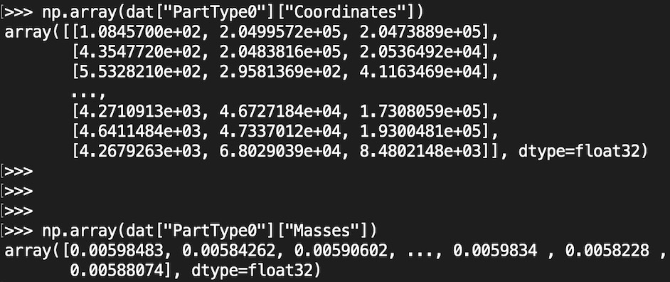
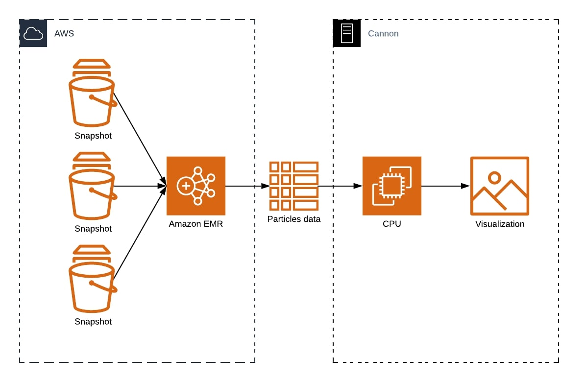

## TRACKING GALAXIES OVER TIME

### Motivation

Ever since the Big Bang until present-day, galaxies have been continuously evolving - into the state we all see now and ever-changing. Astronomers have made understanding galaxy formation and evolution possible by building large simulations of sections of the universe: we can “carve out” a part of the universe and record various aspects of particles of interest within for a period of time. By mapping the properties of these particles to 3-dimensional space, we can visualize the behavior of our galaxies of interest. Some of these complicated features include magnetic fields, gas cooling, black holes, and supernovas. These simulations serve as an important building block to unveil the mysteries of the universe.

At the center of every galaxy is a supermassive black hole which grows through swallowing nearby gas and by merging with other black holes. This black hole can inject energy and momentum back into the gas around it, and is therefore integral to the formation and evolution of galaxies.

For our project, we followed the behavior of particles before they fall into black holes using particle data over time snapshots stored as `hdf5` files. In order to do this, we utilized the tracer particles present in the simulation. These tracer particles track the transfer of mass between different particle types (_eg._ gas converted into stars or gas converted into black holes). Each tracer is associated with a parent cell (either gas, star, or black hole), but the tracer can change which parent it is associated with between each snapshot according to the underlying physics of the simulation. The end result is a movie out of the snapshots containing the positions and masses of the associated particles.

### Knowledge Gap

The regions of the universe we "carve out" (referred to as boxes) are variable in size, with the largest being 300 Mpc in distance. Furthermore, the smaller boxes - or subboxes - are subsections of the large boxes:

The size and number of snapshots also vary across boxes and subboxes, as shown in the table below:

Size | TNG50 | TNG100 | TNG300
:---: | :---: | :---: | :---:
Snapshot size (up to) | 2.7 TB | 1.7 TB | 4.1 TB
Total size | 320 TB | 73 TB | 201.5 TB
Subbox snapshot (up to) | NA | 8.9 GB (~8,000 snapshots) | 20.5 GB (~2,500 snapshots)
Subbox total size (up to) | NA | 41 TB | 19.6 TB

In addition to the three boxes, each box has three resolution levels. We focused on the TNG100 box and the two lowest resolution levels (TNG100-3 and TNG100-2). Because of time constraints, we were not able to test our pipeline on the highest resolution (TNG100-1).

The need for efficient big data processing becomes obvious as we aim to analyze the evolution of a small region in the universe over a long period of time. Each box usually consists of thousands to hundreds of thousands of galaxies, and each galaxy is resolved with up to tens of thousands resolution elements. Normally, we are only interested in a small region of the simulation, so we need to locate our particles of interest from a huge list and access and store their properties with ease. Additionally, visualization of the galaxies is compute-intensive as we map the particle positions to a 2-dimensional grid.

### Data

We used the Illustris TNG dataset, which is stored on Cannon in `/n/hernquistfs3/IllustrisTNG`. If you have a Cannon userID, access can be obtained by filling out a request form [here](https://portal.rc.fas.harvard.edu/request/grants/add).

Below is a simple schematic demonstrating the file and data organization:

Data for each box is stored under a subdirectory called Runs. The directory name for the boxes is an alphanumeric string that takes the form of `L<xxx>n<xxxx>TNG`, where

* L is box size
* N is number of particles/resolution cubed

_(so a directory with the name `L205n1250TNG` means that the box size is 205 Mpc with 1,250 particles3)_.

Within each box’s directory, the snapshot `hdf5` files are stored in their respective snapshot directories starting with `snapdir`. Each file contains two layers in hierarchical order:

* Layer 1, `PartType<x>`: headers specifying particle types
* Layer 2, `Properties`: properties of the particles of the same type

Here is an example to access the properties of particles:

_(Note: not every snapshot contains all of the particle types, and not every particle has all of the properties. As we saw later on, this poses its own challenges.)_

### Existing Work

Common techniques to analyze these large sets of data either parallelize at the scheduler level (_eg._ SLURM), which is cumbersome and requires tedious post-processing of the results, or through distributed memory parallelism (_eg._ MPI), which presents significant implementation overhead. To mitigate this, we aimed to process the simulation data using Spark.

### Our Solution

To create the simulations from the snapshot files, we processed the snapshots using the Amazon EMR framework and visualized the results taking advantage of CPU computing using OpenMP on Cannon.

Specifically, we took the following steps:

1. Upload snapshot files from Cannon to AWS S3 buckets.

2. Generate a list of snapshot files from which to search for `particleID`s of interest. In our case, this consists of all of the snapshots with their complete paths.

3. After a galaxy of interest and its corresponding supermassive black hole were identified by hand, generate particles of interest in two ways:

a. Identify all gas cells within a certain radius of that galaxy at each snapshot.

b. At the final snapshot, identify all tracer particles associated with the central blackhole. Then, at each previous snapshot, identify the position of those tracer particles whether they are associated black holes, gas, or stars.

4. At each snapshot, the positions, masses, and densities for both Steps 3a and 3b were saved.

5. Post-process for visualization using OpenMP implemented in Python through [`pymp`](https://github.com/classner/pymp). Particles mass distribution

6. Create movie for simulation using `FuncAnimation` from `matplotlib`.

The source code for our project can be found [here](../master/src).

### Parallel Application

Our application uses a single program, multiple data (SPMD) execution model that distributes tasks and simultaneously runs them on multiple processors and nodes. We took advantage of functional parallelism (task parallelism), decomposing the problem into smaller tasks and assigning these to the processors. We executed our model at the loop level, as the majority of our tasks consists of iterating through large lists of files as well as through lines of individual files.

### Programming Models

Our application uses a hybrid programming model consisting of Spark and OpenMP to address the big data and big compute problems, respectively.

* Spark: the generation, location, and query of our particleIDs of interest is a repetitive process that searches through the files and outputs each particle’s properties we need to create the simulation. The Spark framework partitions the data into RDDs and operates on them in a parallel fashion, writing outputs only when we need them, which greatly reduces storage and runtime.

* OpenMP: to make a movie using the particle properties obtained using Spark, we need to do a significant amount of post-processing of the results. In addition to the binning, we also found that applying a Gaussian smoothing filter to the particle data was necessary in order to make the visualization look nice. We implemented the binning and smoothing function in C and exposed this procedure to python using the ctypes library. This function was applied to each snapshot, which we also parallelized through OpenMP using the pymp library. This procedure was implemented on Cannon.

### Platform and Infrastructure

* AWS S3 buckets for data storage
* EMR for Spark implementation
* Cannon for OpenMP and high-performance computing

### Software Design

We use 3 Spark jobs:

* To get the gas information

* To get the tracer last snapshot before they fall into blackhole

* To get tracer information

### Tutorial for Code

To run spark job: 

Check out the repository at https://github.com/jenliketen/cs_205_project

In both files, there is a line snaps = range(0, 4380) that control how many snapshots we want to run. To run on a smaller set of data, modify it to snaps = range(4375, 4380)

Now we can either run the job by:

Spinning up an EMR cluster, recommended to use 4-6 core nodes of m5.xlarge instances

Scp the 2 files to the cluster, and run spark-submit --master yarn --total-executor-cores 10 --conf SPARK_ACCESS_KEY=<your aws access key> --conf SPARK_SECRET_KEY=<your aws secret key> <script-file>

Script file can be either fetch_gas_mid_reso_aws.py or fetch_gas_mid_reso_aws.py

To run on Cannon, load the following modules:

module load Anaconda3/5.0.1-fasrc02

module load python/3.6.3-fasrc02

module load ffmpeg/4.0.2-fasrc01

### Replicability Information

Specs of the system	

	Instance type: AWS m5.xlarge instance
  
Model: Intel(R) Xeon(R) Platinum 8175M CPU @ 2.50GHz

	Number of CPUs: 4
  
	Number of cores per CPU: 2
  
	Clock rate: 2.50 GHz
  
Cache memory: 32 K

Main memory: 122 GiB
 							
Operating system

	Amazon Linux 2018.03
  
Movie making is done on Cannon	

Spark cluster

Number of worker instances: 1, 2, 4

 	Release label: emr-5.29.0
  
 	Hadoop distribution: Amazon
  
 	Applications: Ganglia 3.7.2, Spark 2.4.4, Zeppelin 0.8.2 
  
Python, version 3.6.6

Numpy, version

H5py, version

OpenMP, version

### Speedup and Scaling

For TNG100-3:

Collect data serially takes 21 minutes

Collect data using a cluster of 6 worker nodes take 5.4 minutes

For TNG100-2

Collecting data for tracer takes 1h 50 minutes

Collecting data for particles take

Strong scaling speedup is tested using 20 snapshots

Weak scaling speedup is tested using 10 to 80 snapshots

### Overheads

* I/O overhead: we have a massive amount of data splitting each snapshot into multiple files. This issue was addressed by uploading low-resolution snapshots into AWS S3 buckets.
* Communication overhead: introduced through the mapping of gas cells to particleIDs. We were able to mitigate this overhead through parallel processing in Spark.
* Synchronization overhead: mostly in the post-processing phase. This was resolved with shared-memory computing with OpenMP.

### Advanced Data Structures

We used the hdf5 file format, which is highly hierarchical and not simply lines in a file. The hdf5 format works great with our data; however, it poses its own challenges as well (see below).

### Challenges

* Queue times made developing Spark job on Cannon take too long, and so we could not implement our framework on the highest resolution run
* Eventually decided to migrate ~1TB of data to S3 and use EMR
* HDF5 is not optimal for cloud storage
* We had originally wanted to output all of the properties of interest at once. However, since not all particle types contain these properties, this existing structure would introduce very complex loops that would make the Spark execution difficult. In the end, our most important properties were simply the coordinates, the masses, and the densities, so we called them separately instead. 
* For the highest resolution run, the subbox contained a total of 11.2 TB of data, which was too much to upload to S3 (would run through our credits). While the data is on Cannon, we were not able to set up a spark cluster on Cannon due to technical difficulties and long queue times.

### Closing Remarks

Overall, we achieved our project objectives and make easy-to-understand simulations for galaxy formation. We saw that by using Spark, we were able to process a large amount of data relatively efficiently. Cannon is not optimized for this type of data processing, but future flagship simulations which will have even greater data requirements can possibly use an EMR-like framework to optimize data locality. Additionally, analyzing individual snapshots can probably be performed on a single node using big compute paradigms, but analyzing a large number of snapshots would require big data paradigms.

### Citations

Weinberger, R., Springel, V., Hernquist, L., et al. 2017, MNRAS, 465, 3291

Pillepich, A., Springel, V., Nelson, D., et al. 2018b, MNRAS, 473, 4077
